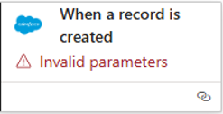
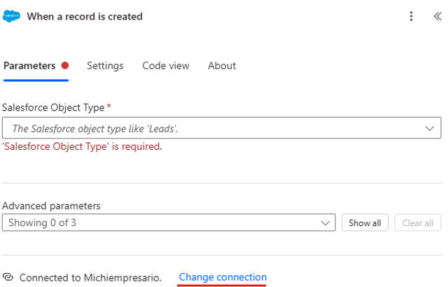
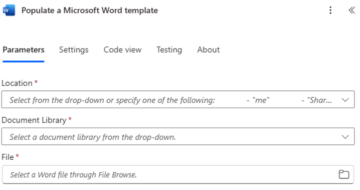
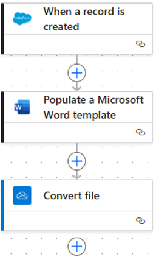
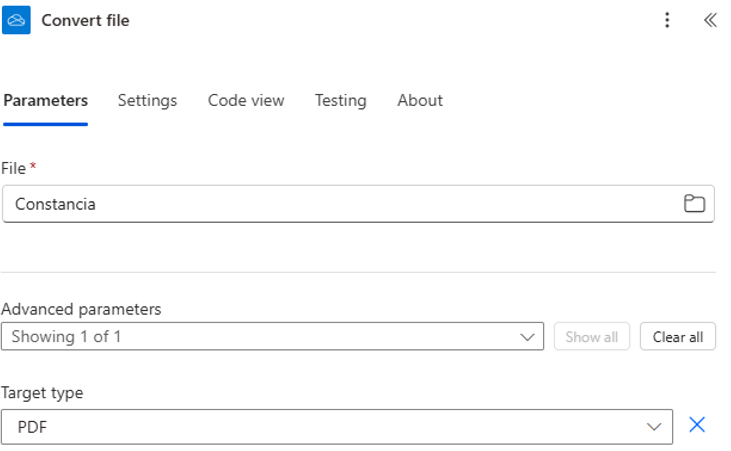
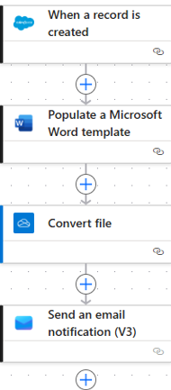

# Baby Salesforce

Maestro. Fredy Israel Colli Yah  
Equipo 3. Einstein  
PM: Rodrigo Joaquín Pacab Canul  
Investigador: Alec Manuel Montes de Oca  

## Estudio caso de uso

¿Es posible emplear Salesforce con Power Automate para generar documentos?

## Objetivos

- Investigar si es posible la generación de constancias mediante power automate

- Conocer que otras funcionalidades proporciona power automate

- Describir las ventajas, desventajas y limitaciones que tiene power automate

- Descubrir que opciones tiene y como se integran a Salesforce y como emplearlos

## Introducción

Power Automate es una herramienta de Microsoft de automatización de flujos de trabajo que permite conectar aplicaciones y servicios para automatizar tareas repetitivas, sincronizar archivos, obtener notificaciones, recopilan datos y mucho más, ayudando a mejorar la productividad.

Este caso de estudio utiliza la versión cloud. Teniendo una versión lanzada el 6 de noviembre de 2025 con su respectiva versión llamada 11.2511.161.0. 

## Documentación en línea: 

Se utiliza una cuenta institucional de UADY para utilizar el Power Automate, caso contrario requiere de una suscripción de $15.00usd al mes o de $150.00usd anuales.

## Descripcion del Flow para generar una constancia

Dentro de la sección créate se busca el conector Salesforce, apareciendo dos opciones de conectores. Uno es el CloudTools for Salesforce y el otro Salesforce. Seleccionando la opción de Salesforce.

El flujo de trabajo automatizado (flujo) que conecta a Salesforce con la generación de documentos sigue los siguientes pasos:

- Trigger: Este inicia el Flow al crearse o modificarse un registro específico en Salesforce. La condición puede ser, por ejemplo, que se marque la casilla booleana “Enviar Constancia”.

- Obtención de datos: El Flow utiliza la acción del conector de Salesforce para recuperar todos los campos necesarios. Se puede obtener cualquier tipo de dato: nombre del participante, fecha del evento, nombre del curso, ID del registro, etc.…

- Generación de documento: Se requiere una plantilla de Word almacenada en SharePoint o OneDrive for Business (funciona con el correo institucional). Esta plantilla debe contener controles de contenido (campos que actúan como variables), cuyos nombres deben coincidir con los campos que Salesforce envía. Se utiliza la acción “Poblar un documento de Microsoft Word” (de Word Online – Business).

- Almacenamiento: El Flow utiliza la acción “Crear archivo” para guardar el documento final en formato PDF o DOCX. Puede usarse la acción “Create record” del conector de Salesforce para crear una tarea asociada al contacto y cargar el documento generado como un archivo adjunto asociado al registro original. Opcionalmente, se puede usar la acción “Send an email” para enviar la constancia al interesado.

Nota: También puede utilizarse la acción “Send an email” para enviar la notificación por correo electrónico al interesado.

Entonces, selecciona el Flow como lo muestra la siguiente figura:

Después de conectarse a la dev o la org de Salesforce como se observa en la Figura 2, se procede con agregar un evento de baja de condicionamiento, donde si se marca tal casilla llamada “Enviar constancia” entonces es cuando debe de generar el documento, en caso de que no se encuentre marcada deberá dar una etiqueta de parámetros inválidos como se muestra en la Figura 1.

Después se agrega un evento de bajo de cuando se modifica / crea algo y se añade la opción de “Poblar un documento de Microsoft Word” obteniendo la siguiente ventana de configuración:

En location aparece las opciones de OneDrive, OneDrive for Business, Sharepoint y Attachments, en el caso donde se guarde la plantilla en OneDrive personal solo se podrá ver desde la cuenta en donde se guarda en cambio si se utiliza el OneDrive empresarial (Business) estando dentro de UADY tenga acceso udaba a la carpeta y se lo manda probablemente se pueda ver. Para este caso de estudio se ha utilizado el OneDrive empresarial, aunado a ello, en la opción del documento aparece: lista de archivos recientes, documentos desde OneDrive, desde un enlace y la lista dinámica, para poder utilizar la variable de la org de Salesforce, se debe emplear el modo lista dinámica con el id del registro. En otra parte de la ventana aparecerá el nombre de los datos en los cuales serán el número de campos que se utilizaran dentro de la plantilla de Word.

Todos los campos deberán tener el nombre del campo de la plantilla de Word a la que se emplea, por lo tanto, para mejores recomendaciones se emplea que tenga identificadores fáciles de identificar, puesto que en el caso de este estudio se realiza un ejemplo desde 0 para obtener palabras más identificables en lugar de emplear las originarias, tal y como se observa en la siguiente figura es lo que se debe tener al momento.

Como demostrado en la anterior figura, en archivo (file) debe de ir el content para que transforme el archivo de docx al tipo de archivo que se desee y en el apartado de escribir el tipo de archivo se utiliza la extensión de PDF. Aunado, a ello se utiliza unidades de la Power Platform para almacenar en una carpeta dicha constancia al igual que enviar una notificación por correo electrónico como se observa en la Figura 6.

Una vez conectado al correo electrónico se puede almacenar el archivo en la plataforma que tengan mediante el correo institucional y pueden recibir la notificación. Además, entonces la Figura 7 demuestra cómo se debe observar el flujo final.

## Análisis de características clave

- Facilidad de uso

Se utiliza una interfaz grafica para arrastrar y soltar elementos que permite a los usuarios sin conocimientos previos de programación, crear flujos de trabajo complejos, aunque conceptualmente, se debe tener claro una serie de conocimientos de programación y lógica de programación para poder conectar de manera correcta los bloques de Power Automate.

La herramienta ofrece cientos de plantillas preconfiguradas para automatizaciones comunes, lo que sienta la base para entender cómo funcionan los flujos sin partir de cero.

Aunque el uso de las herramientas requiere tener ciertas bases de programación, por lo misma, generación de nuevos parámetros dentro de un flujo, el uso de campos, condicionales y operadores tiene una curva de aprendizaje significativamente en comparación a una codificación tradicional en determinado lenguaje de programación (ya que esta herramienta utiliza varios lenguajes de programación y en algunas partes muestra la sintaxis haciendo que el usuario pueda aprender dicha sintaxis).

Es ideal para analistas de negocio y usuarios avanzados de la UADY.

- Escalabilidad

Esta construido sobre la infraestructura de Azure, lo que garantiza alta disponibilidad y capacidad para procesar millones de ejecuciones por flujo. La escalabilidad se gestiona a través de los planes de licencia, que definen los límites de solicitudes de API por usuario o por flujo, en este caso, la base de UADY utiliza herramientas de cloud por lo que su servidor puede ser escalable a través de contrato mas no a través del servicio (se podría en caso de que existiera la opción de visualizar la cantidad de flujos que tienen en determinado tiempo para poder observar los datos, pero únicamente es observable por administración).

Los conectores premium en primera instancia parecen estar incluidos bajo la licencia institucional gestionada por UADY. Por lo tanto, parece ser necesario utilizar el correo institucional como previamente explicado.

- Seguridad

La seguridad se basa en la autenticación se gestiona mediante OAuth 2.0 para los conectores de Microsoft 365, Salesforce y otros servicios importantes además, las credenciales no se almacenan directamente en el flujo. Sino que, se guardan como una conexión protegida, lo que reduce el riesgo de exposición.

Una integración con Microsoft Entra ID, se permite que exclusivamente usuarios autorizados puedan crear, modificar, o ejecutar flujos. Además, los administradores pueden configurar políticas de prevención de pérdida de datos (DLP) para limitar qué conectores se pueden usar juntos en un mismo flujo, evitando que datos sensibles de Salesforce se envíen a un servicio de almacenamiento público no autorizado).

- Flexibilidad

Power Automate cuenta con cientos de conectores preconstruidos que permiten integrar aplicaciones populares como los servicios de Google, SAP, Dynamics, etc.

Se puede personalizar las lógicas a través de expresiones basadas en cadenas, fechas, JSON, o arreglos, además de permitir estructuras de control avanzadas como bucles y condicionales anidadas.

Los flujos también pueden realizar solicitudes directas a APIs de terceros o utilizar la API REST de Salesforce.

## Ventajas, Desventajas y Limitaciones

En cuanto a las ventajas se puede distinguir los siguientes puntos:

- Automatiza tareas repetitivas al instante, reduciendo la carga operacional del personal de la UADY para enforcase en actividades de mayor valor.

- Funciona sin problemas con todo el entorno de Microsoft, siendo un componente clave en el ecosistema de Microsoft, que es el paquete que utiliza la UADY.

- Permite a los usuarios de negocio crear y mantener sus propias automatizaciones sin depender del equipo de TI.

- Ofrece un papel de control para ver el historial de ejecuciones, detectar errores y monitorear el rendimiento del Flow.

Por lo contrario, entre sus desventajas y limitaciones se encuentra:

- Los flows están sujetos a limites diarios de llamadas a la API de Salesforce y a limites de la Power Platform, esto marca límites a la cantidad de registros que pueden crearse y modificarse en una hora determinada. Esto se puede volver problemático para flujos de gran volumen. Por lo tanto, hay que realizar una investigación de uso.

- El conector Salesforce en Power Automate requiere de una licencia premium, por lo que para utilizar todos los beneficios y conectores deben adquirir un coste adicional.

- En las nuevas actualizaciones, no se admiten campos personalizados de selección múltiple en las acciones de creación o actualización de registros. Por lo que se debe de utilizar variables planas.

- La configuración de la seguridad de sesión en Salesforce puede bloquear la conexión desde Power Automate, si se tienen políticas estrictas como login IP ranges, por lo tanto, puede requerir ajustes de configuración desde el lado de Salesforce.

- No se admite el manejo directo de objetos anidados en las acciones de creación o actualización, ya que los campos complejos deben mapearse previamente o gestionarse con otras acciones.

- Los tokens de autenticación de Salesforce pueden caducar si no se utilizan durante un tiempo, lo que puede provocar fallos en el flujo hasta que se renueve la conexión.

Mas limitaciones y documentación encontrada en: 

https://learn.microsoft.com/en-us/connectors/salesforce

## Conclusiones y Resultados

Posterior a la investigación, podemos observar los objetivos específicos que se plantearon en este caso de estudio para concluir la pregunta inicial.

1. Investigar si es posible la generación de constancias mediante power automate

Si, si es posible, requiere de una cuenta institucional de la UADY, una cuenta en la dev o la org de Salesforce, empleando los eventos descritos en la Figura 7.

2. Conocer que otras funcionalidades proporciona power automate

Se cubrió en una primera instancia que otras funcionalidades tiene Power Automate, demostrando que proveen mucho potencial para automatizar procesos complejos en y alrededor de Salesforce, extrayendo información y empleándola en otro lado.

3. Describir las ventajas, desventajas y limitaciones que tiene power automate

Se describió correctamente, las ventajas, desventajas y limitaciones de la plataforma cloud de Power Automate, además de una documentación de Microsoft que también describe estos puntos.

4. Descubrir que opciones tiene y como se integran a Salesforce y como emplearlos

Se realizo un descubrimiento correcto de todas las opciones y se describió como se llega a realizar.

Puesto que se cumplieron los objetivos específicos, también se ha cumplido sobre el objetivó general sobre el estudio de caso de uso, por lo tanto:

¿Es posible emplear Salesforce con power automate para generar documentos?

Si, es totalmente posible.

El proceso se apoya en la sólida integración que ofrece el conector de Salesforce en Power Automate combinado con conectores de Microsoft 365, como Word Online y SharePoint/OneDrive.

# Arquitectura EFCEA alineada con EDA (Salesforce)

Para la gestión de los instructores (Capacitadores), se ha decidido utilizar el objeto estándar
**Contact**, agrupados bajo una **Business Account** contenedora (“Catálogo de Instructores”),
extendiendo su funcionalidad operativa mediante un **Custom Object** (`Capacitador__c`).

Se descartó el uso de **Person Accounts** para este rol, reservando dicha funcionalidad
exclusivamente para los **Alumnos (B2C)**.

---

## A. Principio de Separación de Responsabilidades (SoC)

En el modelo de negocio de Educación Continua, existen dos actores fundamentales con
ciclos de vida opuestos:

- **Alumno (Ingreso / Revenue)**  
  Es un cliente B2C. Su ciclo es **comercial**  
  `Lead → Opportunity → Enrollment`.

- **Instructor (Costo / Expense)**  
  Es un proveedor de servicios o colaborador. Su ciclo es **operativo**  
  `Contract → Assignment → Payment`.

Utilizar **Contactos** para los instructores permite mantener una **higiene de datos estricta**:

- Evitamos que los instructores entren en segmentaciones de Marketing Automation,
  Journey Builder o reportes de proyecciones de ventas destinados a alumnos.
- Prevenimos la contaminación de la base de datos de clientes.

---

## B. Patrón de diseño “Role Object” (Extensión de Objeto)

La arquitectura implementada separa la **Identidad** del **Rol**:

- **Identidad (`Contact`)**  
  Almacena datos demográficos persistentes y públicos  
  (Nombre, Email, Teléfono).

- **Rol administrativo (`Capacitador__c`)**  
  Almacena datos contractuales, sensibles y temporales  
  (Datos bancarios, RFC, Costo hora, Estatus laboral).

Este desacoplamiento permite una **gestión granular de la seguridad (Field-Level Security)**:

- Los equipos de Ventas pueden ver el **Contact** para saber quién da el curso.
- Solo **RRHH / Finanzas** tienen acceso al objeto `Capacitador__c` para ver información
  sensible de pagos.

---

## C. Estrategia “Bucket Account”

Dado que Salesforce requiere que todo **Contacto** esté vinculado a una **Cuenta**, y que
los instructores suelen ser freelancers sin empresa propia, se implementó una **Business
Account contenedora**:

- **Cuenta “Catálogo de Instructores”** (Bucket Account).

Esta cuenta actúa como un **“directorio lógico”**, que:

- Facilita la gestión masiva de instructores.
- Permite heredar permisos de forma centralizada.
- Evita crear miles de cuentas “dummy” individuales que fragmentarían el almacenamiento.

---

## 3. Alineación con Estándares de la Industria (EDA)

Esta implementación no es arbitraria; sigue los principios de arquitectura de la
**Education Data Architecture (EDA)**, el estándar oficial de Salesforce para el sector
educativo, pero adaptada a una **implementación ligera (Lightweight Implementation)**.

Estamos recreando la robustez de EDA **sin** la sobrecarga técnica de instalar el paquete
gestionado completo.

### 3.1 Tabla de alineación con EDA

| Concepto de negocio     | Implementación custom (nuestra arquitectura) | Estándar EDA (Salesforce)        | Validación    |
|-------------------------|----------------------------------------------|----------------------------------|--------------|
| Catálogo de cursos      | `Product2`                                   | `Course`                         | Alineado     |
| Instancia del curso     | `EventoEC__c` (Custom)                       | `Course Offering`                | Alineado     |
| Alumno                  | `Person Account`                             | `Contact` (Student Record Type)  | Compatible   |
| Capacitador             | `Contact` (en Bucket Account)                | `Contact` (Faculty Record Type)  | Idéntico     |
| Relación laboral        | `Capacitador__c` + Lookup                    | `Affiliation`                    | Equivalente  |
| Inscripción             | `Inscripcion__c`                             | `Course Connection` (Student)    | Alineado     |
| Asignación docente      | `Asignacion_Instructor__c`                   | `Course Connection` (Faculty)    | Alineado     |

---

## 4. Conclusión

El uso combinado de **Contactos + Custom Object** bajo una **Business Account** proporciona
una arquitectura **escalable, segura y limpia** para el manejo de proveedores de servicios
educativos.

Este enfoque permite manejar escenarios futuros complejos, como la **polimorfia del usuario**
(p. ej. un instructor que decide inscribirse también como alumno), sin duplicidad de datos ni
conflictos de permisos, y se alinea con las mejores prácticas globales de arquitectura de
datos en Salesforce.

Para más detalle sobre el modelo de datos estándar EDA, puede consultarse el ERD oficial:

- [EDA ERD (Salesforce.org)](https://sfdo-docs.s3.us-west-2.amazonaws.com/EDA_ERD.pdf)

# Validación de documentos

La funcionalidad principal de este módulo es el flujo de **Validar documentos**, que permite a la
Coordinación revisar todos los documentos asociados a una oportunidad
de inscripción y marcarlos como **Válido** o **No Válido**.

## Punto de entrada

- Aplicación: **Coordinación**
- Navegación: pestaña **“Validar documentos”**

## Flujo funcional

1. **Selección de oportunidad**

   - La Coordinación abre la pestaña **Validar documentos** en la app de Coordinación.
   - El flujo muestra una pantalla con una lista de **Oportunidades con documentos pendientes** de validación.
   - El usuario selecciona una oportunidad y hace clic en **Next**.

2. **Validación en lote de documentos**

   - El sistema carga todos los registros de `Documento__c` relacionados con la oportunidad seleccionada.
   - Se muestra una tabla con una fila por documento, con las columnas:
     - **Documento** – nombre o tipo del documento (ej. Comprobante de pago, Certificado de titulación).
     - **Decisión** – picklist con las opciones `Válido`, `No Válido` o `—`.
     - **Comentario** – texto opcional donde la Coordinación explica el motivo si marca `No Válido`.
     - **Ver** – botón/ícono de “ojo” que abre el archivo en Salesforce Files en una nueva pestaña.
   - Encima de la tabla se muestran las instrucciones de uso y la **guía visual**:
     - Filas en verde: documentos marcados como **Válidos**.
     - Filas en rojo: documentos marcados como **No Válidos**.
     - Fondo azulado: filas modificadas en la sesión actual (aún no guardadas).

3. **Revisión del archivo**

   - Para cada documento, la Coordinación hace clic en **Ver** para abrir el archivo en otra pestaña.
   - Revisa el contenido y regresa a la pantalla del flujo.

4. **Registro de la decisión**

   - En la columna **Decisión**, la Coordinación selecciona:
     - `Válido`, si el documento cumple con los requisitos.
     - `No Válido`, si el documento está incompleto, incorrecto o ilegible.
   - Si elige `No Válido`, se recomienda escribir un motivo en la columna **Comentario**  
     (por ejemplo: “INE borrosa”, “Recibo de pago vencido”, etc.).

5. **Guardado de cambios**

   - Al hacer clic en **Next**, el flujo actualiza todos los registros de `Documento__c`
     mostrados en la tabla:
     - Campo `Estado_de_validacion__c` → `Válido` o `No Válido`.
     - Campo `Comentario_de_revision__c` → texto capturado en la columna Comentario.

6. **Fin del flujo**

   - Tras guardar los cambios, el flujo muestra un mensaje de confirmación y permite regresar
     a la selección de otra oportunidad con documentos pendientes.

## Objetos y campos involucrados

- **Oportunidad (`Opportunity`)**
  - Se utiliza como contexto para agrupar los documentos que deben ser validados.

- **Documento (`Documento__c`)**
  - Lookup a `Opportunity` (`Opportunity__c`).
  - `Estado_de_validacion__c` (Picklist: Pendiente, Válido, No Válido).
  - `Comentario_de_revision__c` (Long Text).
  - Campos informativos: tipo de documento, fecha de carga, referencia a `ContentDocument`, etc.

